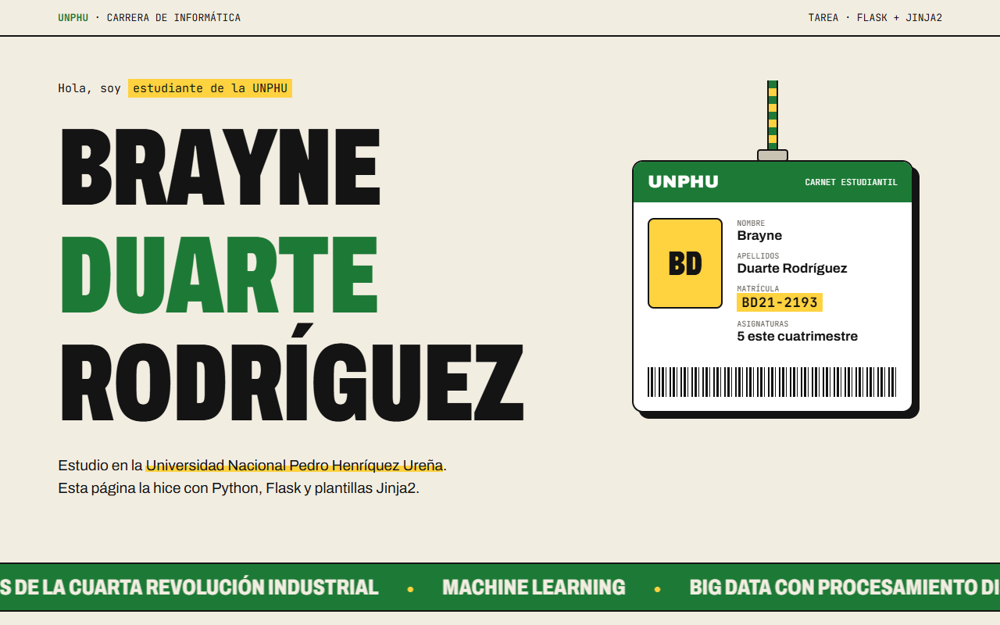
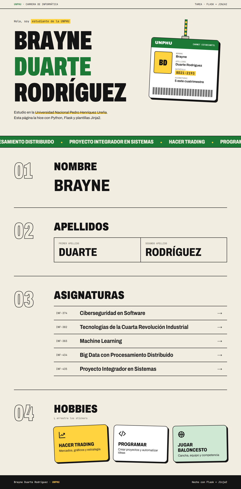

# Perfil con Flask y Jinja2 · UNPHU

**Brayne Duarte Rodríguez** — Universidad Nacional Pedro Henríquez Ureña (UNPHU)

Página web hecha con Flask que muestra nombre, apellidos, asignaturas y hobbies.
Ningún dato está escrito en el HTML: todo se define en `app.py` y se envía a la
plantilla `templates/index.html` con `render_template`.

## Cómo cumple los requisitos

| Requisito | Dónde |
|---|---|
| Python y Flask | `app.py` |
| Al menos una ruta | `@app.route("/")` → `inicio()` |
| Al menos una plantilla | `templates/index.html` |
| Datos enviados por variables | `render_template("index.html", nombre=..., apellidos=..., ...)` |
| Variables | `nombre`, `universidad`, `siglas`, `matricula` |
| Diccionario | `apellidos = {"primero": ..., "segundo": ...}` |
| Listas | `asignaturas` (5, con código) y `hobbies` (3), listas de diccionarios |
| Jinja2 | `{{ nombre }}`, `{{ apellidos.primero }}`, macro `icono()`, filtros `length` y `upper` |
| Ciclo `for` de Jinja2 | `` y `` (también el nombre letra por letra) |

## Diseño

Estilo editorial tipo afiche universitario con los colores de la UNPHU:

- Cortina verde de entrada con contador de 0 a 100.
- Nombre que sube línea por línea; cada letra rebota al pasar el mouse.
- Carnet estudiantil colgando de un cordón que se balancea con el scroll y el mouse.
- Cinta que se inclina y acelera según la velocidad del scroll.
- Números de sección que se llenan de verde al avanzar.
- Asignaturas que se "decodifican" letra por letra al pasar el mouse.
- Stickers de hobbies que se pueden arrastrar y regresan con rebote.

Respeta `prefers-reduced-motion`.

## Ejecutar

```bash
pip install -r requirements.txt
python app.py
```

Abrir http://localhost:5000

## Capturas




